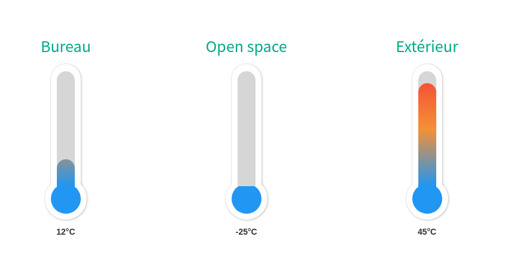

# A React Thermometer Component

## Screenshot



## Install

```sh
$ yarn add react-thermometer-ecotropy
```

## Usage

```js
import React from 'react'
import { render } from 'react-dom'
import Thermometer from 'react-thermometer-ecotropy'

render(
  <Thermometer
    theme="light"
    value="18"
    max="100"
    steps="3"
    format="°C"
    size="large"
    height="300"
  />
, document.getElementById('container'))
```

## API:

| Param | Type | Description | Example | Default |
| --- | --- | --- | --- | --- |
| `theme` | `String` | Light or Dark | `theme="light"` | light |
| `value` | `Number` | Temperature value | `value={27}` | 0 |
| `max` | `Number` | Maximum value of thermometer | `max={100}` | 100 |
| `steps` | `Number` | Thermometer dividers | `steps={3}` | 0 |
| `format` | `String` | Degrees format | `format="°C"` | '' |
| `size` | `String` | Thermometer size. Can be small, normal or large | `size="large"` | normal |
| `height` | `Number` | Thermometer height | `height={300}` | 200 |
| `tooltipValue` | `Boolean` | Display the value | `tooltipValue={true}` | `true` |
# Note

This component is based on https://github.com/zamarrowski/react-thermometer-component
